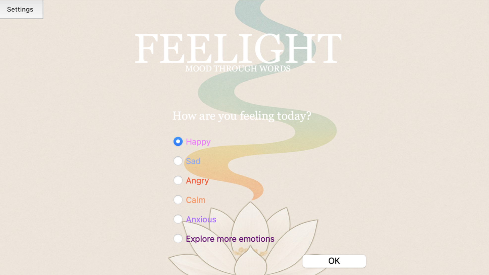
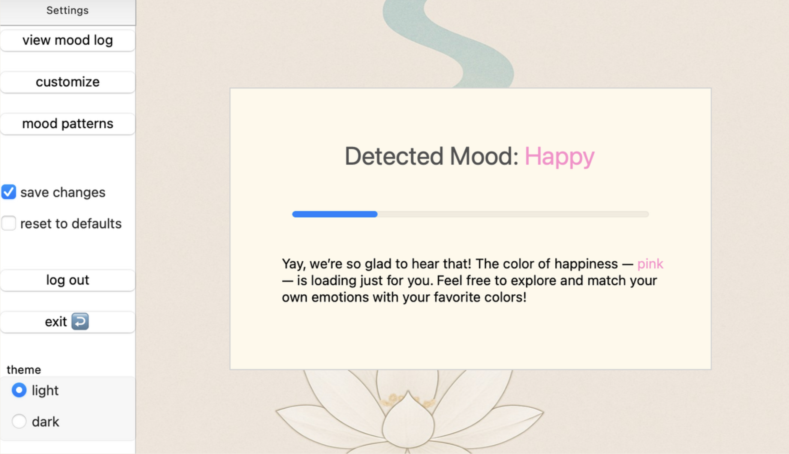

# Feelight – Mood Through Words

Feelight is a desktop mood analysis prototype that detects emotions from user-written text and visualizes feelings using colors and charts.

The system provides real-time emotional feedback and tracks mood history over time to help users better understand their emotional patterns.

-----

## Project Purpose
The aim of Feelight is to analyze the emotional tone of text input and transform it into visual feedback.

Users can:
- write how they feel
- detect their emotion automatically
- see the matching color instantly
- track mood history
- analyze daily and weekly trends

This promotes personal awareness and emotional tracking.

-----

## Features
- Text-based emotion detection
- Real-time color feedback
- Mood history logging (date + emotion + color)
- Daily & weekly mood trend graphs
- Customizable themes and color mappings
- Offline desktop usage
- Lightweight interface built with PyQt5

-----

## Tech Stack
- Python
- PyQt5 (GUI)
- Qt Designer
- Matplotlib (data visualization)
- JSON / Dictionary-based emotion mapping

-----

## System Design
The project includes full software engineering documentation:
- [Use Case Diagram](diagrams/feelight_usecase.png)
- [Class Diagram](diagrams/feelight_class.png)
- [Sequence Diagram](diagrams/feelight_sequence.png)
- [Activity Diagram](diagrams/feelight_activity.png)
- [Database Design (ERD)](diagrams/feelight_database_erd.png)

[View all diagrams](./diagrams/)

[VPD files](./vpd/)


-----

## Data & Visualization
Feelight stores historical mood data and generates:
- Daily emotion distribution
- Weekly trends
- Mood pattern insights

These visualizations help users monitor emotional changes over time.

-----

## Screenshots



-----

## How to Run
```bash
pip install pyqt5 matplotlib
python feelight.py
