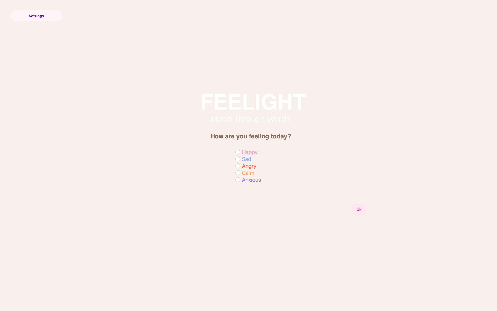
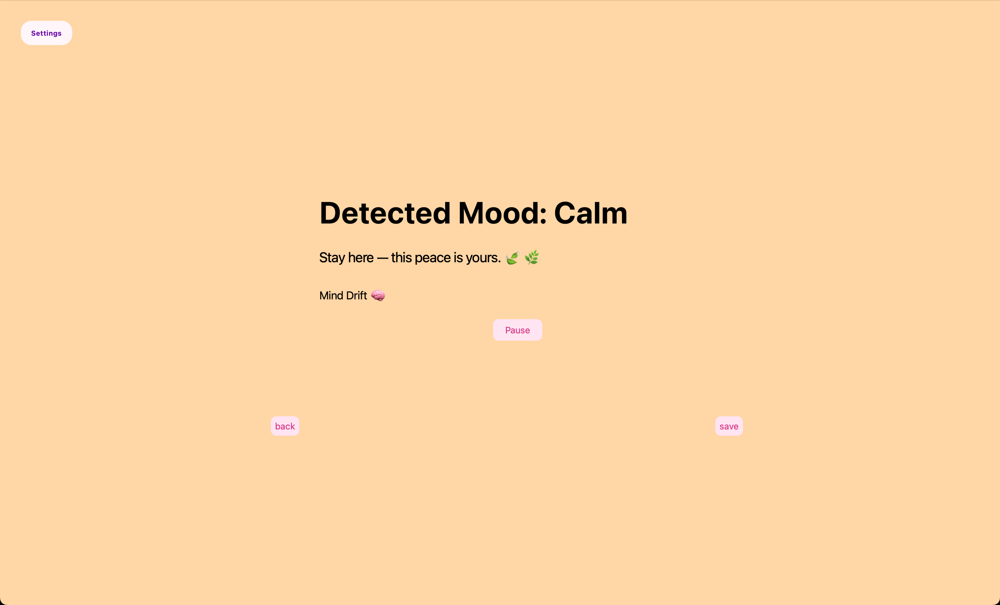
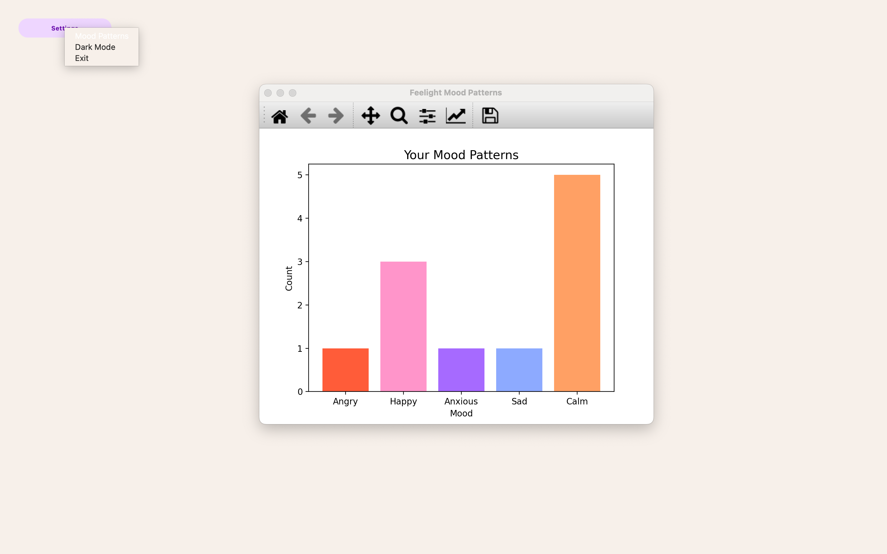

# Feelight – Emotion-Aware Mood Tracking Desktop App

Feelight is an emotion-aware desktop application that transforms user feelings into a multi-sensory experience using color, music, and data visualization.

It provides real-time emotional feedback and tracks mood history to help users better understand their emotional patterns.

---

## Project Purpose

The goal of Feelight is to transform user emotions into a multi-sensory experience.

Users can:

- Select or express how they feel  
- Receive instant visual feedback through color  
- Get personalized motivational quotes  
- Listen to mood-based music  
- Store their mood history  
- Analyze emotional trends over time  

This promotes self-awareness and emotional tracking.

---

## Key Features

- Emotion selection & detection system  
- Dynamic color-based UI (emotion-driven backgrounds)  
- Personalized motivational quotes (database-based)  
- Mood-based music recommendation & playback  
- Mood history storage (PostgreSQL)  
- Mood analytics & visualization (Matplotlib)  
- Dark mode toggle  
- Interactive settings menu  
- Pause / Resume music control  

---

## Screenshots

### Mood Selection


### Mood Result


### Mood Analytics


---

## System Architecture

The system consists of:

- Frontend: PyQt5 GUI (multi-screen navigation)  
- Backend: PostgreSQL database  
- Logic Layer: Python (emotion handling, randomization, state management)  
- Visualization: Matplotlib  
- Media Engine: Pygame (music playback)  

---

## System Design
The project includes full software engineering documentation:
- [Use Case Diagram](diagrams/feelight_usecase.png)
- [Class Diagram](diagrams/feelight_class.png)
- [Sequence Diagram](diagrams/feelight_sequence.png)
- [Activity Diagram](diagrams/feelight_activity.png)
- [Database Design (ERD)](diagrams/feelight_database_erd.png)

[View all diagrams](./diagrams/)

[VPD files](./vpd/)


-----

## Database Structure

### Tables:

moods
- id  
- mood  
- timestamp  

quotes
- id  
- mood  
- text  

music
- id  
- mood  
- title  
- file_path  

---

## Data & Visualization

Feelight analyzes stored mood data and generates:

- Mood frequency distribution  
- Emotional trend insights  

All visualized using bar charts via Matplotlib.

---

## Application Flow

1. User selects their current mood  
2. System transitions to result screen  
3. Emotion is displayed with:
   - Matching background color  
   - Motivational quote  
   - Suggested music  
4. User can:
   - Save mood to database  
   - View mood patterns  
   - Toggle dark mode  
   - Control music playback  

---

## Tech Stack

- Python  
- PyQt5  
- PostgreSQL (psycopg2)  
- Matplotlib  
- Pygame  

---

## How to Run

Install required libraries:

```bash
pip install pyqt5 matplotlib psycopg2 pygame
```

Run the application:

```bash
python main.py
```
---

## Project Highlights

- Combines UI, database, and multimedia into one system  
- Real-time emotion-based feedback loop  
- Persistent mood tracking with analytics  
- User-centered emotional awareness design  

---

## Note

Make sure to configure your PostgreSQL credentials before running the project.

---

## Future Improvements

- NLP-based emotion detection from free text  
- Mobile application version  
- User authentication system  
- Advanced analytics (weekly/monthly trends)  
- Cloud database integration  


